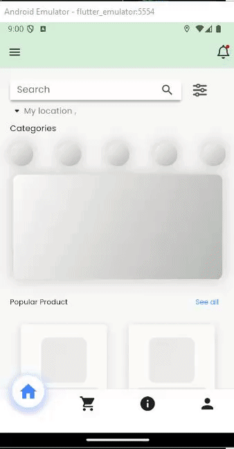

# Flutter Shopping Application

This is a stylish and functional-ish~ shopping application built with Flutter. The app incorporates various Flutter widgets and packages to create a modern and responsive user interface. The design is enhanced with animations, shadows, and color schemes selected from [ColorHunt](https://colorhunt.co/).

## Features

- **Custom Widgets**: The app is modular with custom widgets like `ProductCard` for product display and various other reusable components.
- **Shimmer Effect**: Placeholder shimmer animations are used to enhance the user experience while data is loading.
- **Curved Navigation Bar**: A curved navigation bar is implemented for a smoother navigation experience.
- **Stylized Drawer**: A greenish-themed drawer with FontAwesome icons for easy navigation (no functionalities since you can use bottom bar).
- **BottomSheet Animation**: A stylish `BottomSheet` with a greenish theme appears when an item is added to the cart.
- **TabBar & TabBarView**: To switch between different categories like Vegetables, Fruits, Meat, etc.
- **ScaleTransition**: For animating the appearance of certain widgets like images and texts.
- **Geolocation**: This app uses the `geolocator` package for geolocation services. The app requests location permissions as soon as it launches, ensuring the necessary permissions are in place for accurate geolocation functionality (for both IOS - Android).
- **Custom Fonts**: The default font family for the app is set to **Poppins**, providing a clean and modern look across the entire user interface.

## Packages Used

- **curved_navigation_bar: ^1.0.6**: For the curved navigation bar at the bottom of the app.
- **flutter_login: ^5.0.0**: Provides a customizable login screen for the app.
- **font_awesome_flutter: ^10.7.0**: A package for using FontAwesome icons in the app.
- **geolocator: ^13.0.1**: For fetching the device's location.
- **google_fonts: ^6.2.1**: To easily use Google Fonts in the app.
- **shimmer_animation: ^2.2.1**: For creating shimmer effects to indicate loading states.

# Here is how it look:

## Home Page

This home page features a nice shimmer effect that appears while data is loading, providing a smooth visual transition. At the top, it also displays your current location, indicating where the delivery will be made.

## Items Page

This page features a toolbar for navigating different sections. Additionally, a stylish bottom sheet appears when the "Add to Cart" button is pressed

## Drawer

This drawer features multiple buttons for various functions, with user information displayed at the top. It is designed to align with the overall green-themed style of the application.

## About Us Page

The About Us page is designed in a simple way while using [ColorHunt](https://colorhunt.co/) and does not include interactive functionalities. I utilized `RPSCustomPainter` and the [Flutter Shape Maker](https://fluttershapemaker.com/#/) to convert SVG images into code, enhancing the visual appeal of the page.

## Bottom Navigation Bar

I used the [`curved_navigation_bar`](https://pub.dev/packages/curved_navigation_bar) package to enhance the appearance of the bottom navigation bar. Additionally, I added custom transition animations to make the navigation experience even more visually appealing.

## Registeration Page

After clicking on the Register text in the Login UI
This registration UI saves user data in a list of maps and includes a validation check to ensure that the email is not already in use.
password must be atleast 8 long , and email must include valid input.

## Login Page

The Login page features an animated picture at the top that floats up and down. It also includes input validation to ensure that user credentials are entered correctly.

** Feel free to test the app yourself :) **
